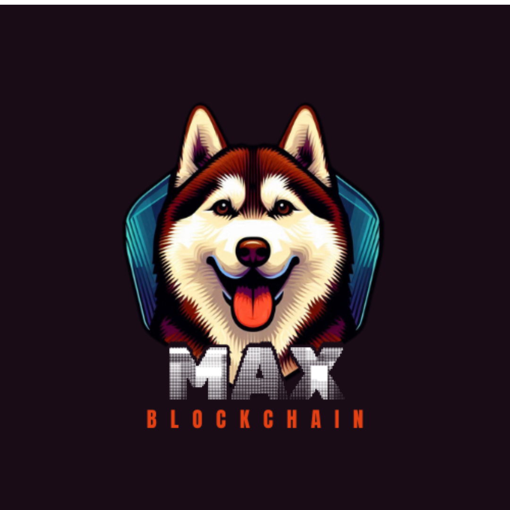

# Portfólio Blockchain



## 🌐 Visão Geral | Overview

[Português]
Este é meu portfólio profissional, focado em desenvolvimento blockchain e Web3. O site apresenta minhas habilidades, projetos e certificações na área de tecnologia blockchain, com suporte para os idiomas Português e Inglês.

[English]
This is my professional portfolio, focused on blockchain development and Web3. The website showcases my skills, projects, and certifications in the blockchain technology field, with support for both Portuguese and English languages.

## 🚀 Funcionalidades | Features

- 🔄 Suporte para múltiplos idiomas (PT/EN) | Multi-language support (PT/EN)
- 📱 Design responsivo | Responsive design
- 🎯 Seções organizadas | Organized sections:
  - Sobre | About
  - Certificações | Certifications
  - Habilidades | Skills
  - Projetos | Projects
  - Contato | Contact

## 💻 Projetos Destacados | Featured Projects

- **Max Blockchain**: Ecossistema blockchain completo com tokens, NFTs e jogo interativo
- **Slime Wallet**: Carteira digital para gerenciamento de criptoativos
- **Auditor de Contratos**: Ferramenta para auditoria de smart contracts

## 🛠️ Tecnologias Utilizadas | Technologies Used

- HTML5
- CSS3
- JavaScript
- jQuery
- Owl Carousel
- Font Awesome
- Ion Icons

## 📚 Certificações | Certifications

- Fundamentos da Web3
- Introdução a Smart Contracts
- Foundry
- Hyperledger
- Solidity
- Vulnerabilidade de Smart Contracts
- Engenharia de Prompt

## 📞 Contato | Contact

- LinkedIn: [jefferson2601](https://linkedin.com/in/jefferson2601)
- GitHub: [jefferson2601](https://github.com/jefferson2601)
- WhatsApp: [(98) 98509-3657](https://wa.me/5598985093657)
- Email: jefferson260114@gmail.com

## 🌟 Como Executar | How to Run

1. Clone o repositório | Clone the repository:
```bash
git clone https://github.com/jefferson2601/portifolio-blockchain.git
```

2. Abra o arquivo index.html em seu navegador | Open index.html in your browser

## 📄 Licença | License

Este projeto está sob a licença MIT. Veja o arquivo [LICENSE](LICENSE) para mais detalhes.
This project is under the MIT license. See the [LICENSE](LICENSE) file for more details.